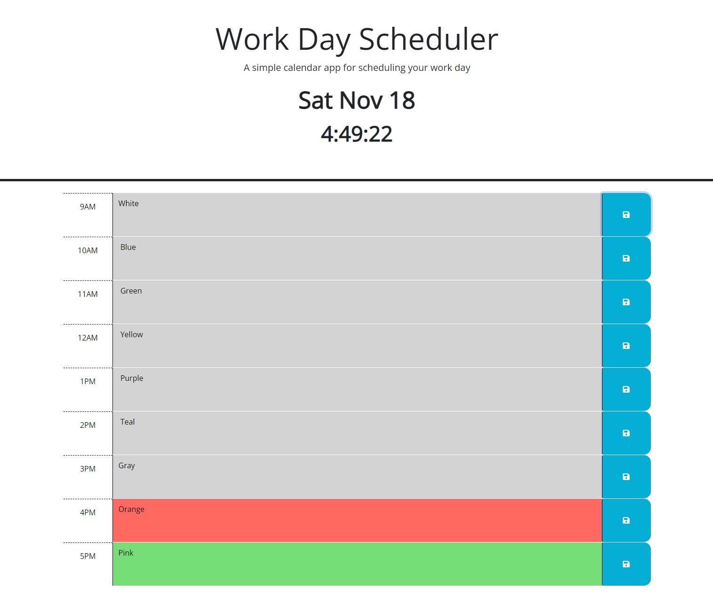

# Daily Planner

## Description
The Daily Planner is a simple web application designed to help employees manage their busy schedules effectively. Users can add important events to a daily schedule, with each time block color-coded to indicate whether it is in the past, present, or future. Additionally, the application allows users to save events, ensuring that the schedule persists even after a page refresh.

## Features
Current Day Display: Upon opening the planner, the current day is prominently displayed at the top of the calendar.

Timeblocks for Standard Business Hours: As users scroll down, they are presented with time blocks for the standard business hours of 9am–5pm.

Color-Coded Timeblocks: Each time block is color-coded to indicate whether it is in the past, present, or future. This visual representation helps users quickly identify the status of each time block.

Event Entry: Users can click into a time block and enter an event for that specific hour.

Save Events to Local Storage: After entering an event, users can save it by clicking the save button for that time block. The text for the event is then saved in local storage.

Persistent Saved Events: Even after refreshing the page, the saved events persist, ensuring that users can rely on the application to retain their schedules.

## Usage
Open the Daily Planner web application.

Scroll down to view time blocks.

Color-coded time blocks will indicate whether they are in the past, present, or future.

Click into a time block to enter an event.

Save the event by clicking the save button for that time block.

Refresh the page, and the saved events will persist.

## Technologies Used
HTML
CSS
JavaScript
jQuery (for DOM manipulation)
Local Storage (for data persistence)

## Application Preview
 

## Link
